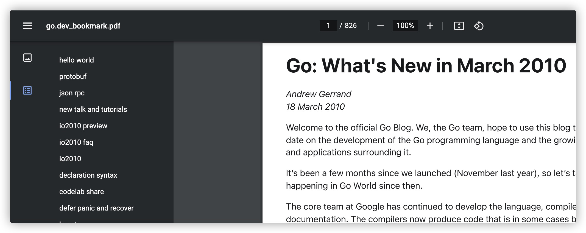
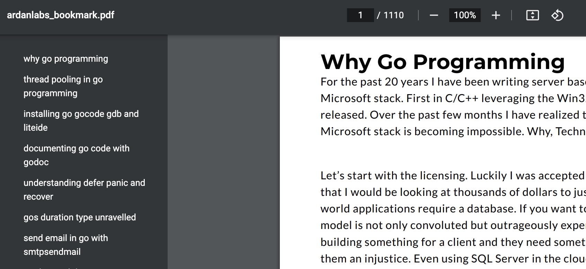

# DL

下载一些感兴趣的文章，并装订成PDF。

## 使用方法

```
go run cmd/main.go -website=ardanlabs -action=111 
``` 

#### [The Go Blog](https://go.dev/blog/all)



#### [Ardanlabs](https://www.ardanlabs.com/all-posts/)

